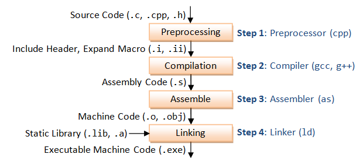

# Build steps for gcc

`gcc --help` show the options of the command 

```
-Xassembler <arg>        Pass <arg> on to the assembler.
-Xpreprocessor <arg>     Pass <arg> on to the preprocessor.
-Xlinker <arg>           Pass <arg> on to the linker.
-save-temps              Do not delete intermediate files.
-save-temps=<arg>        Do not delete intermediate files.
-pipe                    Use pipes rather than intermediate files.
-time                    Time the execution of each subprocess.
-specs=<file>            Override built-in specs with the contents of <file>.
-std=<standard>          Assume that the input sources are for <standard>.
--sysroot=<directory>    Use <directory> as the root directory for headers and libraries.
-B <directory>           Add <directory> to the compiler's search paths.
-o <file>                Place the output into <file>.
-v                       Display the programs invoked by the compiler.
-###                     Like -v but options quoted and commands not executed.
-pie                     Create a dynamically linked position independent executable.
-shared                  Create a shared library.
```

these flag/options allow to get which output of the build process we are intrested in 



<!--  -->

```
-E                       Preprocess only; do not compile, assemble or link.
-S                       Compile only; do not assemble or link.
-c                       Compile and assemble, but do not link.
```


so for example if we want to Compile only (-S), the command would be `gcc -S main.c`


